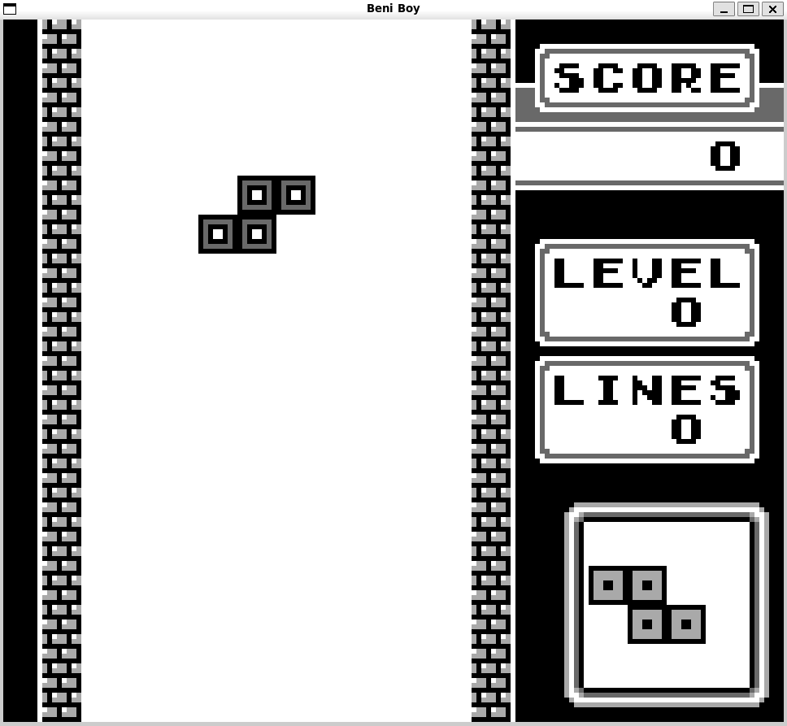
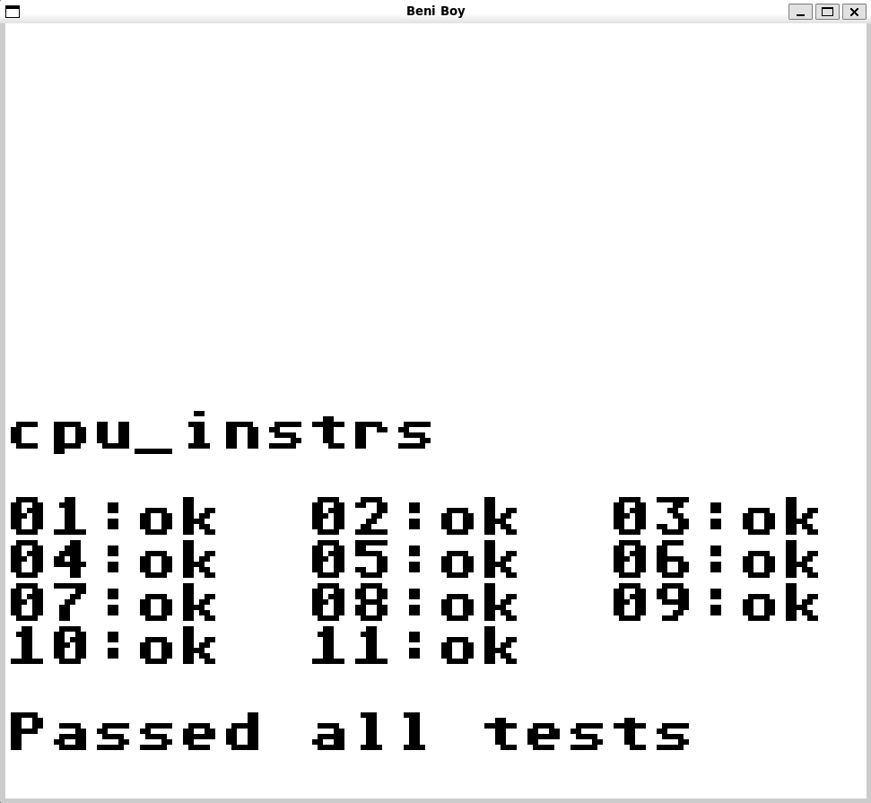
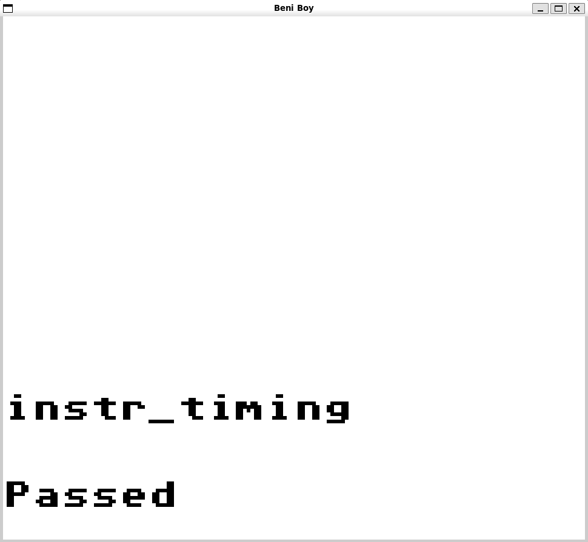
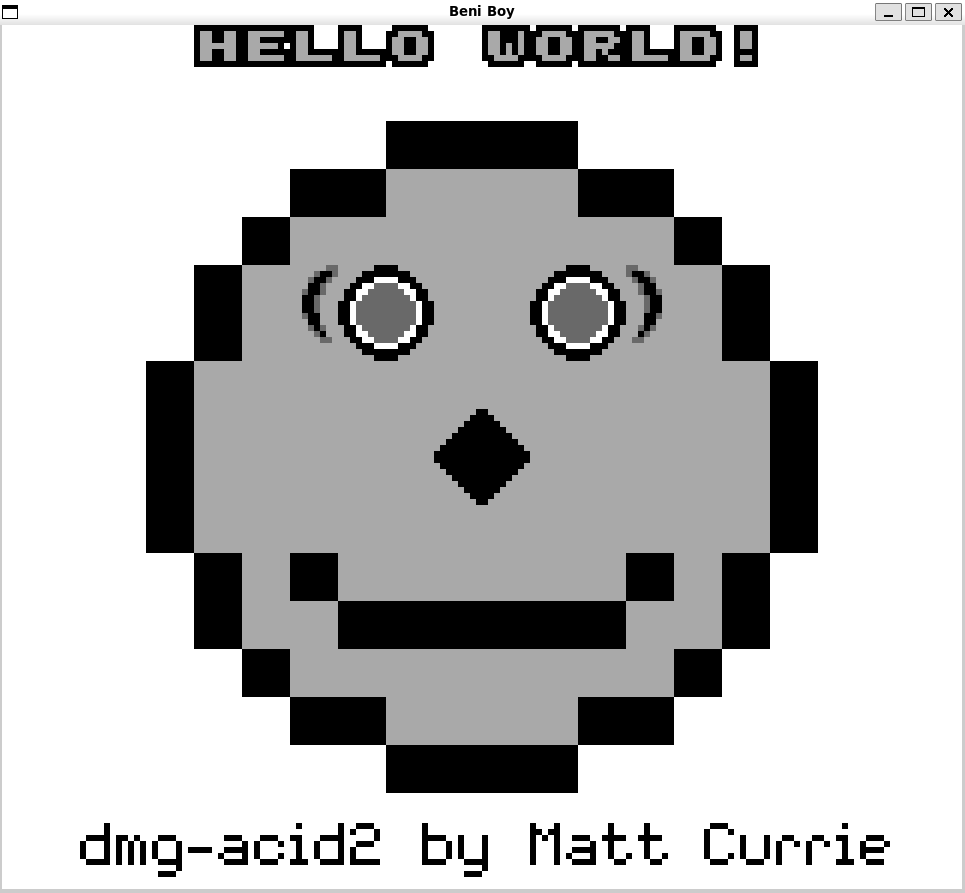

# Beni Boy

A Game Boy (DMG) emulator written in C with SDL2.

<p align="center">
  
</p>

I built this emulator during the summer of 2020, between my second and third
years of university. The goal was to understand how emulators work and how the
Game Boy hardware operates, while also improving my C programming. The code has
since been cleaned up for publishing on GitHub, but it remains largely as it was
originally written. It hasn't been reworked or extended since then, so the bugs
and limitations it had at the time are still there.

## Features

**CPU**
- Full Sharp LR35902 instruction set, including every CB-prefixed opcode
- Cycle counts per instruction, conditional branches take their extra cycles
- Interrupts (V-Blank, LCD STAT, Timer, Joypad) with the one-instruction delay after `EI`
- `HALT`

**PPU**
- Background, window and sprites, stepping through the OAM search / pixel transfer / H-Blank / V-Blank modes
- For simplicity it uses a scanline renderer instead of emulating the real pixel FIFO, so mode 3 always takes the same time and mid-scanline tricks may not render correctly
- 8x8 and 8x16 sprites, X/Y flipping, both object palettes, BG priority bit
- 10 sprites per scanline limit, with sprites sorted by X for priority
- STAT interrupts (LY=LYC, mode 0/1/2) and turning the LCD on and off

**Cartridges**
- ROM only
- MBC1 (ROM banking)
- MBC3 with RAM and battery, plus a basic RTC that reads your system clock when the game latches it

The mapper support is fairly minimal and was written just to get specific games
running, so some cartridges may not work properly:
- Only cartridge types `0x00`, `0x01`, `0x10` and `0x13` are accepted. Anything else,
  including MBC1+RAM (`0x02`, `0x03`) and the other MBC3 variants, is refused at load time
- MBC1 has no RAM banking and no banking mode select
- RAM enable writes are ignored, so external RAM is always accessible
- The RTC only reports seconds, minutes and hours. It can't be written to or halted,
  and the day counter is always 0

**Other stuff**
- Timer (DIV, TIMA, TMA, TAC)
- Joypad
- OAM DMA
- Battery saves: the cartridge RAM is mapped straight to a `.sav` file next to the ROM, so progress is written as you play
- Serial output goes to the terminal, which is how the Blargg test ROMs report their results
- Runs at the real ~59.7 fps

## Controls

| Game Boy | Keyboard    |
| -------- | ----------- |
| D-pad    | Arrow keys  |
| A        | `A`         |
| B        | `D`         |
| Start    | `Q`         |
| Select   | `E`         |

Close the window to quit.

## Building

The emulator is written to run on a little-endian x86 Linux machine with SDL2
installed. To build and run it:

```sh
make
./build/beni-boy path/to/rom.gb
```

`make clean` wipes the `build/` folder.

## Tested games

These are the games I tested during development:

| Game           | Mapper                 | Status                 |
| -------------- | ---------------------- | ---------------------- |
| Tetris         | ROM only               | Playable               |
| Dr. Mario      | ROM only               | Playable               |
| Pokémon Red    | MBC3+RAM+BATTERY       | Playable, saving works |
| Pokémon Silver | MBC3+TIMER+RAM+BATTERY | Partially tested       |

Pokémon Silver runs in DMG mode. I only tested it briefly: it boots and you can
walk around for a while, but after some time graphical artifacts show up and
the game eventually crashes.

Other games that use a supported mapper may work, but they haven't been tested.

## Test ROMs

| Test                    | Result |
| ----------------------- | ------ |
| Blargg `cpu_instrs`     | Pass   |
| Blargg `instr_timing`   | Pass   |
| `dmg-acid2`             | Pass   |

<table align="center">
  <tr>
    <td align="center"></td>
    <td align="center"></td>
    <td align="center"></td>
  </tr>
  <tr>
    <td align="center"><code>cpu_instrs</code></td>
    <td align="center"><code>instr_timing</code></td>
    <td align="center"><code>dmg-acid2</code></td>
  </tr>
</table>

## Not implemented

- Sound
- Game Boy Color mode
- MBC2, MBC5 and the other mappers. MBC1 is missing RAM banking and the mode select
- The `STOP` instruction and the HALT bug
- Boot ROM, it starts directly at `0x0100` with the post-boot register values (to avoid using propietary bootrom)
- Serial link beyond printing to the terminal
- A real RTC. Days and the halt/carry flags are always 0

## Project structure

```
include/        headers
src/
  main.c          SDL window, key mapping, frame timing and the main loop
  gb.c            console setup / teardown, running a frame and joypad input
  cpu.c           register setup and fetch / decode / execute
  instructions.c  opcode table and the implementation of each instruction
  memory.c        memory map and I/O registers
  ppu.c           graphics
  timer.c         DIV / TIMA
  interrupts.c    interrupt dispatch
  cartridge.c     ROM loading, saves and MBCs
```

## Resources

Resources:

- [Pan Docs](https://gbdev.io/pandocs/)
- [gbdev opcode table](https://gbdev.io/gb-opcodes/optables/)
- [EmuDev Discord](https://discord.gg/dkmJAes)
- [Blargg's test ROMs](https://github.com/retrio/gb-test-roms)
- [Mooneye test suite](https://github.com/Gekkio/mooneye-test-suite)
- [dmg-acid2](https://github.com/mattcurrie/dmg-acid2)
